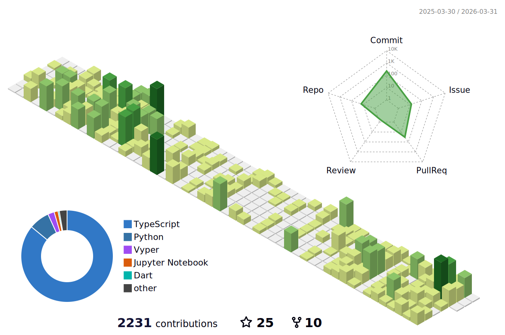

### Wellcome to Antonio Martins's Github Page 📄
<!--
**AntonioAEMartins/AntonioAEMartins** is a ✨ _special_ ✨ repository because its `README.md` (this file) appears on your GitHub profile.

Here are some ideas to get you started:

- 🔭 I’m currently working on ...
- 🌱 I’m currently learning ...
- 👯 I’m looking to collaborate on ...
- 🤔 I’m looking for help with ...
- 💬 Ask me about ...
- 📫 How to reach me: ...
- 😄 Pronouns: ...
- ⚡ Fun fact: ...
-->

## My Stats

<p align="center">
  
  
  
  <br>
  <br>
</p>

<!--START_SECTION:waka-->
<!-- 


**🐱 My GitHub Data** 

> 📦 2.5 MB Used in GitHub's Storage 
 > 
> 🏆 57 Contributions in the Year 2023
 > 
> 💼 Opted to Hire
 > 
> 📜 34 Public Repositories 
 > 
> 🔑 10 Private Repositories 
 > 
**I'm an Early 🐤** 

```text
🌞 Morning                1074 commits        █░░░░░░░░░░░░░░░░░░░░░░░░   05.64 % 
🌆 Daytime                10774 commits       ██████████████░░░░░░░░░░░   56.60 % 
🌃 Evening                6615 commits        █████████░░░░░░░░░░░░░░░░   34.75 % 
🌙 Night                  571 commits         █░░░░░░░░░░░░░░░░░░░░░░░░   03.00 % 
```
📅 **I'm Most Productive on Monday** 

```text
Monday                   4204 commits        ██████░░░░░░░░░░░░░░░░░░░   22.09 % 
Tuesday                  3732 commits        █████░░░░░░░░░░░░░░░░░░░░   19.61 % 
Wednesday                3681 commits        █████░░░░░░░░░░░░░░░░░░░░   19.34 % 
Thursday                 2376 commits        ███░░░░░░░░░░░░░░░░░░░░░░   12.48 % 
Friday                   2388 commits        ███░░░░░░░░░░░░░░░░░░░░░░   12.55 % 
Saturday                 1616 commits        ██░░░░░░░░░░░░░░░░░░░░░░░   08.49 % 
Sunday                   1037 commits        █░░░░░░░░░░░░░░░░░░░░░░░░   05.45 % 
```


📊 **This Week I Spent My Time On** 

```text
🕑︎ Time Zone: Europe/Paris

💬 Programming Languages: 
Other                    3 hrs 5 mins        █████████████████░░░░░░░░   68.29 % 
Markdown                 46 mins             ████░░░░░░░░░░░░░░░░░░░░░   17.24 % 
sh                       19 mins             ██░░░░░░░░░░░░░░░░░░░░░░░   07.04 % 
YAML                     9 mins              █░░░░░░░░░░░░░░░░░░░░░░░░   03.43 % 
JavaScript               6 mins              █░░░░░░░░░░░░░░░░░░░░░░░░   02.55 % 

🔥 Editors: 
Chrome                   2 hrs 43 mins       ███████████████░░░░░░░░░░   60.12 % 
VS Code                  1 hr 29 mins        ████████░░░░░░░░░░░░░░░░░   32.84 % 
Zsh                      19 mins             ██░░░░░░░░░░░░░░░░░░░░░░░   07.04 % 

💻 Operating System: 
Linux                    2 hrs 45 mins       ███████████████░░░░░░░░░░   60.82 % 
WSL                      1 hr 46 mins        ██████████░░░░░░░░░░░░░░░   39.18 % 
```

**I Mostly Code in PHP** 

```text
PHP                      10 repos            ███████░░░░░░░░░░░░░░░░░░   26.32 % 
JavaScript               9 repos             ██████░░░░░░░░░░░░░░░░░░░   23.68 % 
HTML                     8 repos             █████░░░░░░░░░░░░░░░░░░░░   21.05 % 
Vue                      4 repos             ███░░░░░░░░░░░░░░░░░░░░░░   10.53 % 
CSS                      3 repos             ██░░░░░░░░░░░░░░░░░░░░░░░   07.89 % 
```


 Last Updated on 01/04/2023 00:05:43 UTC
END_SECTION:waka -->


