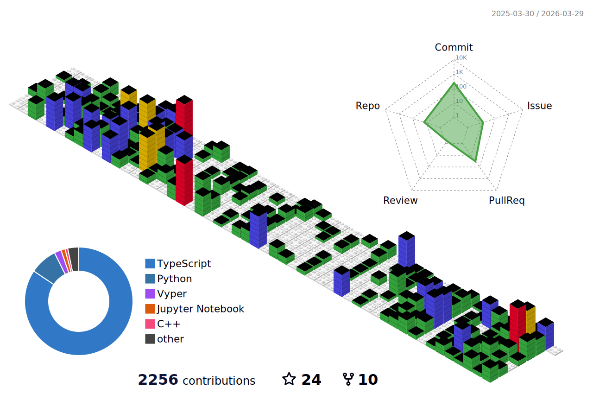

### Welcome to Antônio Martins's GitHub Page 📄

## About Me

👋 I'm Antônio Martins — a Computer Engineering student at Insper and Visiting Student at UC Berkeley (Fall 2025), where I’ve been expanding my experience in AI, systems, and entrepreneurship.

My purpose as an entrepreneur is to transform how people interact with systems by deeply understanding their lives, goals, and pain points — and shipping cutting‑edge technology that creates real impact.

Previously, I:

1. co-founded and led A2C Solutions as CPTO — a software consultancy building web apps and AI-driven tools (Flutter/Dart, NestJS/TypeScript). We worked across agribusiness, benefits management, and retail tech.

2. co-founded and led Astra as CTO, a payment system for restaurants in Brazil, in which we shortened the end-of-meal wait and took payments off the waiter's plate by having a WhatsApp-native checkout fully integrated with the restaurant POS. I developed the product, system architecture, reverse-engineered the POS, and built the backend and integrations (NestJS/TypeScript, MongoDB).

## Languages, Frameworks & Tools

  
  
  
  
  
  
  
  
  
  
  
  
  
  
  
  
  
  
  

## Yearly Stats

## Contact Me

Feel free to connect with me on [LinkedIn](https://www.linkedin.com/in/antônio-martins-8aa1b4198/).
